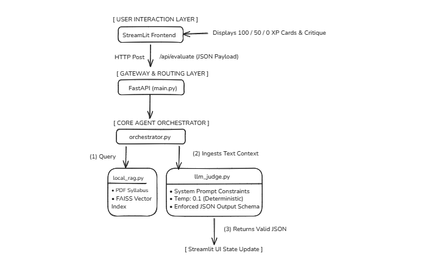

# ⚔️ AzureAI-Proctor: Reasoning Agent Arena

A decoupled, asynchronous, production-grade AI Proctor application designed to evaluate responses against the official **Microsoft AI-901** blueprint using a **Pattern-First** interactive training model.

---

## 🏗️ System Architecture & Telemetry Flow

The application divides front-end visual states from core algorithmic processing layers over a localized RESTful network API path:

1. **Frontend UI (Streamlit):** Coordinates active state persistence across component render-refreshes using `st.session_state`. Manages objective domain selections and score tracking arrays.
2. **Backend API (FastAPI Gateway):** Runs the core processing orchestration layer.
3. **Intel Layer (Foundry IQ):** Executes semantic document retrieval across syllabus chunks using a local vector store, feeding context blocks as ground-truth limits to the reasoning agent.
4. **Judge Brain (LLMJudge):** Leverages a fast language model endpoint under a low deterministic temperature (`0.1`) to score and parse categorical student outputs.

### Pipeline Layout
Here is the design layout for the AzureAI-Proctor local RAG and evaluation pipeline:



---

## 🛠️ Repository File Structures

```text
AzureAI-Proctor/
│
├── backend/
│   └── app/
│       ├── __init__.py
│       ├── local_rag.py       # FAISS indexing/retrieval engine
│       ├── llm_judge.py       # Deterministic evaluation brain
│       ├── orchestrator.py    # Pipeline coordinator agent
│       └── main.py            # FastAPI REST routing gateway
│
├── frontend/
│   ├── app.py                 # Gamified Streamlit UI interface
│   └── questions.json         # Specialized AI-901 Blueprint bank
│
├── .gitignore                 # Shields api keys and local data buffers
└── README.md                  # System operation mapping document
```

---

## 🎥 Project Demonstration

Turn automated proctoring into a gamified, deterministic experience for the Microsoft AI-901 Blueprint exam.

### 👉 [WATCH THE OFFICIAL DEMO VIDEO HERE](https://youtu.be/ka6X3y4ijsQ)
